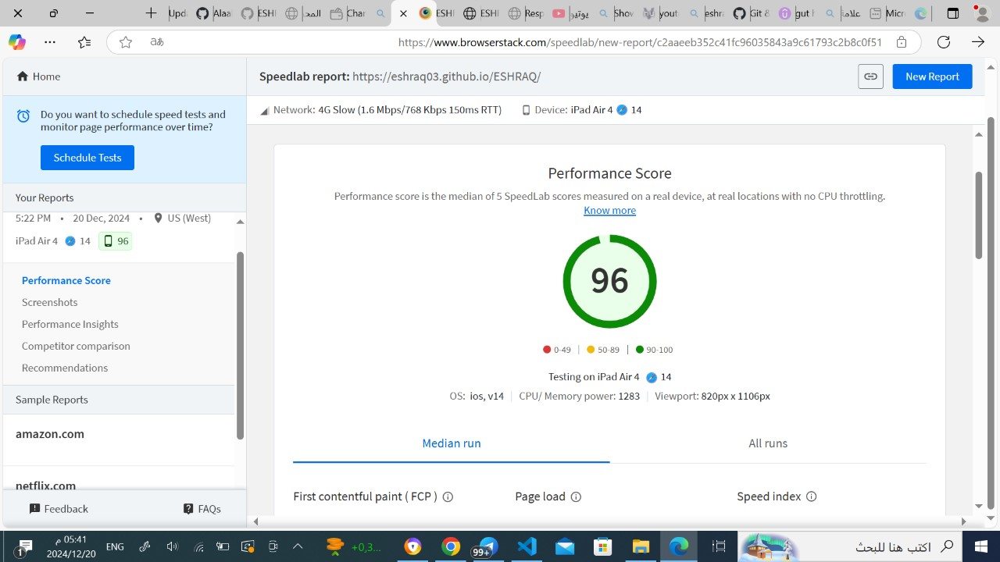
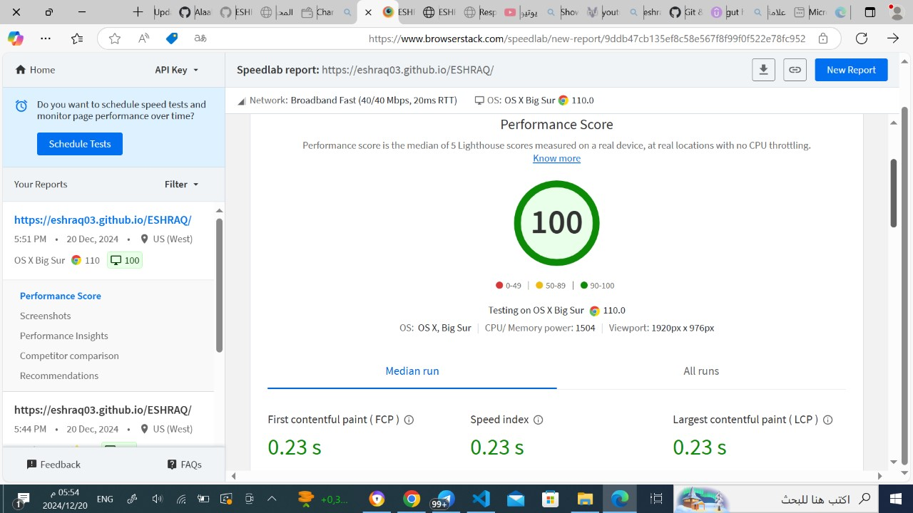

 
The result in safari browser:
 
- **Performance Score**: 96 (Excellent)
 - This score falls within the green range (90-100), indicating excellent performance\.
- **Device Used**: iPad Air 4
- **Network Used**: 4G Slow (1\.6 Mbps/768 Kbps 150ms RTT)
- **Test Date and Time**: December 20, 2024, at 5:22 PM (US - West)
- **Operating System**: iOS v14
- **CPU/Memory Power**: 1283
- **Viewport Size**: 820px x 1106px
- **Score Description**: The performance score is the median of five SpeedLab scores measured on a real device, in real locations with no CPU throttling\.

## Additional Features

- **Left Sidebar Options**:
  - Screenshots
  - Performance Insights
  - Competitor Comparison
  - Recommendations

The result in chrome browser:

- **Performance Score**: 100 (Excellent) - This score falls within the green range (90-100), indicating optimal performance\.
- **Device Used**: Windows 11
- **Browser Version**: 87\.0
- **Network Used**: Broadband Fast (40/40 Mbps, 20ms RTT)
- **Test Date and Time**: December 20, 2024, at 5:44 PM (US - West)
- **CPU/Memory Power**: 705
- **Viewport Size**: 1920px x 1080px
- **Score Description**: The performance score is the median of five SpeedLab scores measured on a real device, in real locations with no CPU throttling\. The score is color-coded: 0-49 in red, 50-89 in yellow, and 90-100 in green\.

## Performance Metrics

- **First Contentful Paint (FCP)**: 0\.81 seconds
- **Page Load**: 1\.55 seconds
- **Speed Index**: Not available (n\.a)

## Additional Features

- **Left Sidebar Options**:
  - Screenshots
  - Performance Insights
  - Competitor Comparison
  - Recommendations
  - Sample Reports for webs

The result in chrome browser:
  

- **Performance Score**: 100 (Excellent) - This score indicates optimal performance\.
- **Device Used**: OS X Big Sur
- **Browser Version**: Chrome 110\.0
- **Network Used**: Broadband Fast (40/40 Mbps, 20ms RTT)
- **Test Date and Time**: December 20, 2024, at 5:51 PM (US West)
- **CPU/Memory Power**: 1504
- **Viewport Size**: 1920px x 976px
- **Score Description**: The performance score is the median of five Lighthouse scores measured on a real device with no CPU throttling\.

## Performance Metrics

- **First Contentful Paint (FCP)**: 0\.23 seconds
- **Speed Index**: 0\.23 seconds
- **Largest Contentful Paint (LCP)**: 0\.23 seconds

## Additional Features

- **Left Sidebar Options**:
  - Screenshots
  - Performance Insights
  - Competitor Comparison
  - Recommendations

